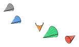
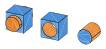

# cadrum

[](https://github.com/lzpel/cadrum/blob/main/LICENSE)
[](https://crates.io/crates/cadrum)
[](https://lzpel.github.io/cadrum)

Rust CAD library powered by [OpenCASCADE](https://dev.opencascade.org/) (OCCT 7.9.3).

<p align="center">
  
</p>

## Usage

More examples with source code are available at [lzpel.github.io/cadrum](https://lzpel.github.io/cadrum).

Add this to your `Cargo.toml`:

```toml
[dependencies]
cadrum = "^0.4"
```

Primitives: box, cylinder, sphere, cone, torus — colored and exported as STEP + SVG. ([`examples/01_primitives.rs`](examples/01_primitives.rs))

## Examples

#### Primitives

```sh
cargo run --example 01_primitives
```

```rust
use cadrum::Solid;
use glam::DVec3;

fn main() {
    let example_name = std::path::Path::new(file!()).file_stem().unwrap().to_str().unwrap();

    let solids = [
        Solid::cube(10.0, 20.0, 30.0)
            .color("#4a90d9"),
        Solid::cylinder(8.0, DVec3::Z, 30.0)
            .translate(DVec3::new(30.0, 0.0, 0.0))
            .color("#e67e22"),
        Solid::sphere(8.0)
            .translate(DVec3::new(60.0, 0.0, 15.0))
            .color("#2ecc71"),
        Solid::cone(8.0, 0.0, DVec3::Z, 30.0)
            .translate(DVec3::new(90.0, 0.0, 0.0))
            .color("#e74c3c"),
        Solid::torus(12.0, 4.0, DVec3::Z)
            .translate(DVec3::new(130.0, 0.0, 15.0))
            .color("#9b59b6"),
    ];

    let mut f = std::fs::File::create(format!("{example_name}.step")).expect("failed to create file");
    cadrum::io::write_step(&solids, &mut f).expect("failed to write STEP");

    let mut svg = std::fs::File::create(format!("{example_name}.svg")).expect("failed to create SVG file");
    cadrum::io::write_svg(&solids, DVec3::new(1.0, 1.0, 1.0), 0.5, &mut svg).expect("failed to write SVG");
}

```

<p align="center">
  
</p>

#### Transform

```sh
cargo run --example 02_transform
```

```rust
use cadrum::Solid;
use glam::DVec3;
use std::f64::consts::PI;

fn main() {
    let example_name = std::path::Path::new(file!()).file_stem().unwrap().to_str().unwrap();

    let base = Solid::cone(8.0, 0.0, DVec3::Z, 20.0)
        .color("#888888");

    let solids = [
        // original — reference, no transform
        base.clone(),
        // translate — shift +20 along Z
        base.clone()
            .color("#4a90d9")
            .translate(DVec3::new(40.0, 0.0, 20.0)),
        // rotate — 90° around X axis so the cone tips toward Y
        base.clone()
            .color("#e67e22")
            .rotate_x(PI / 2.0)
            .translate(DVec3::new(80.0, 0.0, 0.0)),
        // scaled — 1.5x from its local origin
        base.clone()
            .color("#2ecc71")
            .scale(DVec3::ZERO, 1.5)
            .translate(DVec3::new(120.0, 0.0, 0.0)),
        // mirror — flip across Z=0 plane so the tip points down
        base.clone()
            .color("#e74c3c")
            .mirror(DVec3::ZERO, DVec3::Z)
            .translate(DVec3::new(160.0, 0.0, 0.0)),
    ];

    let mut f = std::fs::File::create(format!("{example_name}.step")).expect("failed to create file");
    cadrum::io::write_step(&solids, &mut f).expect("failed to write STEP");

    let mut svg = std::fs::File::create(format!("{example_name}.svg")).expect("failed to create SVG file");
    cadrum::io::write_svg(&solids, DVec3::new(1.0, 1.0, 1.0), 0.5, &mut svg).expect("failed to write SVG");
}

```

<p align="center">
  
</p>

#### Boolean

```sh
cargo run --example 03_boolean
```

```rust
use cadrum::{Solid, SolidExt};
use glam::DVec3;

fn main() -> Result<(), cadrum::Error> {
    let example_name = std::path::Path::new(file!()).file_stem().unwrap().to_str().unwrap();

    let make_box = Solid::cube(20.0, 20.0, 20.0)
        .color("#4a90d9");
    let make_cyl = Solid::cylinder(8.0, DVec3::Z, 30.0)
        .translate(DVec3::new(10.0, 10.0, -5.0))
        .color("#e67e22");

    // union: merge both shapes into one — offset X=0
    let union = make_box.clone()
        .union(&[make_cyl.clone()])?;

    // subtract: box minus cylinder — offset X=40
    let subtract = make_box.clone()
        .subtract(&[make_cyl.clone()])?
        .translate(DVec3::new(40.0, 0.0, 0.0));

    // intersect: only the overlapping volume — offset X=80
    let intersect = make_box.clone()
        .intersect(&[make_cyl.clone()])?
        .translate(DVec3::new(80.0, 0.0, 0.0));

    let shapes: Vec<Solid> = [union, subtract, intersect].concat();

    let mut f = std::fs::File::create(format!("{example_name}.step")).expect("failed to create file");
    cadrum::io::write_step(&shapes, &mut f).expect("failed to write STEP");

    let mut svg = std::fs::File::create(format!("{example_name}.svg")).expect("failed to create SVG file");
    cadrum::io::write_svg(&shapes, DVec3::new(1.0, 1.0, 2.0), 0.5, &mut svg).expect("failed to write SVG");

    Ok(())
}

```

<p align="center">
  
</p>

#### Stretch

```sh
cargo run --example 04_stretch
```

```rust
//! Stretch example: create a cylinder and stretch it along XYZ from its center.
//!
//! ```
//! cargo run --example 02_stretch
//! ```
//!
//! Output: stretched.brep (BRep text format)

use cadrum::Solid;
use cadrum::utils::stretch_vector;
use glam::DVec3;

/// Cut at (cx,cy,cz) and stretch each axis by (dx,dy,dz). Axes with delta <= 0 are skipped.
fn stretch(shape: Vec<Solid>, cx: f64, cy: f64, cz: f64, dx: f64, dy: f64, dz: f64) -> Result<Vec<Solid>, cadrum::Error> {
    let eps = 1e-10;
    let shape = if dx > eps { stretch_vector(&shape, DVec3::new(cx, 0.0, 0.0), DVec3::new(dx, 0.0, 0.0))? } else { shape };
    let shape = if dy > eps { stretch_vector(&shape, DVec3::new(0.0, cy, 0.0), DVec3::new(0.0, dy, 0.0))? } else { shape };
    let shape = if dz > eps { stretch_vector(&shape, DVec3::new(0.0, 0.0, cz), DVec3::new(0.0, 0.0, dz))? } else { shape };
    shape.iter().map(|s| s.clean()).collect()
}

fn main() {
	let example_name = std::path::Path::new(file!()).file_stem().unwrap().to_str().unwrap();
    let radius = 20.0_f64;
    let height = 80.0_f64;
    let cylinder: Vec<Solid> = vec![Solid::cylinder(radius, DVec3::Z, height)];
    let center = DVec3::new(0.0, 0.0, height / 2.0);
    let (dx, dy, dz) = (30.0, 20.0, 40.0);

    println!("cylinder: radius={radius}mm, height={height}mm");
    println!("cut at: {center:?} / stretch: X={dx}mm Y={dy}mm Z={dz}mm");

    let result = stretch(cylinder, center.x, center.y, center.z, dx, dy, dz)
        .expect("stretch failed");

    let out_path = format!("{example_name}.brep");
    let mut buf = Vec::new();
    cadrum::io::write_brep_text(&result, &mut buf).expect("failed to write BRep");
    std::fs::write(out_path, &buf).expect("failed to write file");

    let mesh = cadrum::io::mesh(&result, 0.5).expect("mesh failed");
    println!(
        "done: ({} bytes) — vertices: {}, triangles: {}",
        buf.len(),
        mesh.vertices.len(),
        mesh.indices.len() / 3,
    );
}

```

#### Chijin

```sh
cargo run --example 05_chijin
```

```rust
//! Chijin example: build a chijin (hand drum from Amami Oshima).
//!
//! ```
//! cargo run --example chijin
//! ```
//!
//! Output: chijin.step (AP214 STEP, colored), chijin.svg

use cadrum::{Face, Color, Solid, SolidExt};
use glam::DVec3;
use std::f64::consts::PI;

pub fn chijin() -> Result<Solid, cadrum::Error> {
	// ── Body (cylinder): r=15, h=8, centered at origin (z=-4..+4) ────────
	let cylinder = Solid::cylinder(15.0, DVec3::Z, 8.0)
		.translate(DVec3::new(0.0, 0.0, -4.0))
		.color("#999");

	// ── Rim: cross-section polygon in the x=0 plane, revolved 360° around Z
	let cross_section = Face::from_polygon(&[
		DVec3::new(0.0, 0.0, 5.0),
		DVec3::new(0.0, 15.0, 5.0),
		DVec3::new(0.0, 17.0, 3.0),
		DVec3::new(0.0, 15.0, 4.0),
		DVec3::new(0.0, 0.0, 4.0),
		DVec3::new(0.0, 0.0, 5.0),
	])?;
	let sheet = cross_section
		.revolve(DVec3::ZERO, DVec3::Z, 2.0 * PI)?
		.color("#fff");
	let sheets = [sheet.clone().mirror(DVec3::ZERO, DVec3::Z), sheet];

	// ── Lacing blocks: 2x8x1, rotated 60° around Z, placed at y=15 ──────
	let block_proto = Solid::cube(2.0, 8.0, 1.0)
		.translate(DVec3::new(-1.0, -4.0, -0.5))
		.rotate_z(60.0_f64.to_radians())
		.translate(DVec3::new(0.0, 15.0, 0.0));

	// ── Lacing holes: thin cylinders through each block ──────────────────
	let hole_proto = Solid::cylinder(0.7, DVec3::new(10.0, 0.0, 30.0), 30.0)
		.translate(DVec3::new(-5.0, 16.0, -15.0));

	// Distribute 20 blocks and holes evenly around Z, each block in a rainbow color
	let n = 20usize;
	let mut blocks = Vec::with_capacity(n);
	let mut holes = Vec::with_capacity(n);
	for i in 0..n {
		let angle = 2.0 * PI * (i as f64) / (n as f64);
		let color = Color::from_hsv(i as f32 / n as f32, 1.0, 1.0);
		blocks.push(block_proto.clone().rotate_z(angle).color(color));
		holes.push(hole_proto.clone().rotate_z(angle));
	}
	let blocks = blocks.into_iter()
		.map(|v| vec![v])
		.reduce(|a, b| a.union(&b).unwrap())
		.unwrap();
	let holes = holes.into_iter()
		.map(|v| vec![v])
		.reduce(|a, b| a.union(&b).unwrap())
		.unwrap();

	// ── Assemble with boolean operations: union, subtract, union ─────────
	let result = [cylinder]
		.union(&sheets)?
		.subtract(&holes)?
		.union(&blocks)?;
	assert!(result.len() == 1);
	Ok(result.into_iter().next().unwrap())
}

fn main() -> Result<(), cadrum::Error> {
	let example_name = std::path::Path::new(file!()).file_stem().unwrap().to_str().unwrap();
	let result = [chijin()?];

	let step_path = format!("{example_name}.step");
	let mut f = std::fs::File::create(&step_path).expect("failed to create STEP file");
	cadrum::io::write_step(&result, &mut f).expect("failed to write STEP");
	println!("wrote {step_path}");

	let svg_path = format!("{example_name}.svg");
	let mut f = std::fs::File::create(&svg_path).expect("failed to create SVG file");
	cadrum::io::write_svg(&result, DVec3::new(1.0, 1.0, 1.0), 0.5, &mut f).expect("failed to write SVG");
	println!("wrote {svg_path}");

	Ok(())
}

```

<p align="center">
  
</p>

## Requirements

- A C++17 compiler (GCC, Clang, or MSVC)
- CMake

Tested with GCC 15.2.0 (MinGW-w64) and CMake 3.31.11 on Windows.

## Build

By default, `cargo build` downloads OCCT 7.9.3 source and builds it automatically.
The built library is placed in `target/occt/` and removed by `cargo clean`.

To cache the OCCT build across `cargo clean`, set `OCCT_ROOT` to a persistent directory:

```sh
export OCCT_ROOT=~/occt
cargo build
```

- If `OCCT_ROOT` is set and the directory already contains OCCT libraries, they are linked directly (no rebuild).
- If `OCCT_ROOT` is set but the directory is empty or missing, OCCT is built and installed there.
- To force a rebuild, remove the directory: `rm -rf ~/occt`

## Features

- `color` (default): Colored STEP I/O via XDE (`STEPCAFControl`). Enables `write_step_with_colors`,
  `read_step_with_colors`, and per-face color on `Solid`.
  Colors are preserved through boolean operations and other transformations.

## License

This project is licensed under the MIT License.

Compiled binaries include [OpenCASCADE Technology](https://dev.opencascade.org/) (OCCT),
which is licensed under the [LGPL 2.1](https://dev.opencascade.org/resources/licensing).
Users who distribute applications built with cadrum must comply with the LGPL 2.1 terms.
Since cadrum builds OCCT from source, end users can rebuild and relink OCCT to satisfy this requirement.
