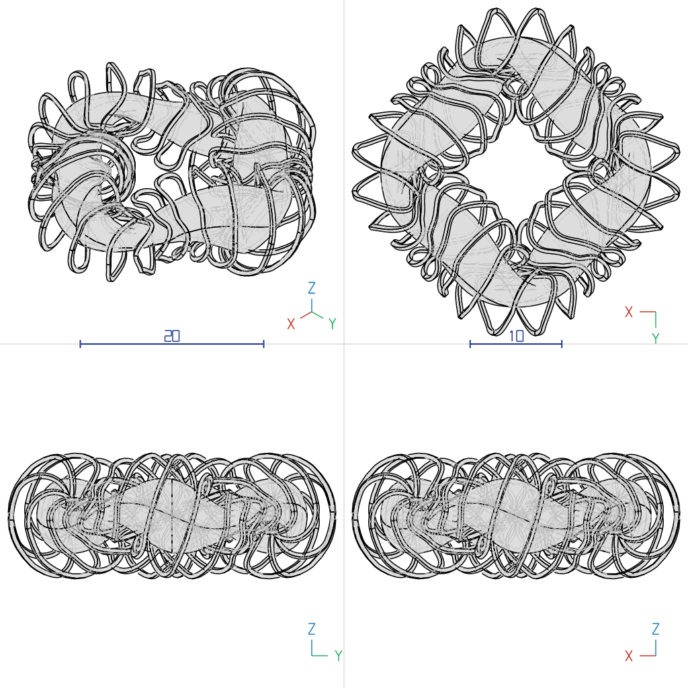
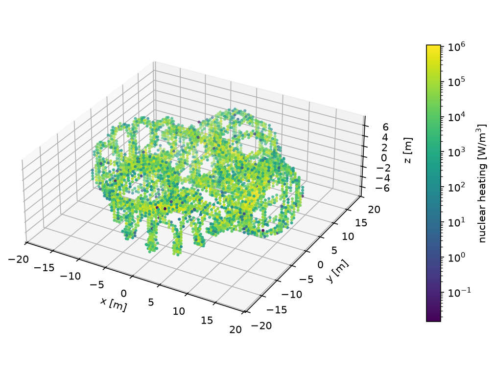

# 概要 (Summary)

<!--target of this-->

cadrum は、パラメトリックな 3D CAD をコードで行うための Rust ライブラリである。オープンソースであり、科学技術分野の作業のための、簡潔でスクリプト化可能な基盤として設計されている。

<!--technology and design-->

cadrum はトポロジーを Rust の型システムで追跡する。トポロジー要素は Solid、Face、Edge という型として公開され、それらを操作する演算はこれらの型のメソッドとなっている。cadrum がラップする OpenCASCADE Technology (OCCT) カーネル [@occt] では、演算の結果は汎用の形状であり、ソリッドが気づかないうちにシェルとして返ってきたり、消失したり、複数の部分に分裂したりすることがある。cadrum はこうしたトポロジーの変化を戻り値の型に反映するため、意図しない形状はそれが生じた場所で検出される。

cadrum は幅広い CAD 演算に対応する。プリミティブ、押し出し、回転、ロフト、ガイド付き経路に沿ったスイープ、B スプライン曲面、シェル化、オフセット、フィレット、面取り、ブーリアン演算を備える。モデルは STEP [@iso10303] 形式で読み書きでき、STL、バイナリ glTF、SVG、PNG として出力できる。

<!-- save time and universal -->

# 必要性 (Statement of need)

研究では、計算から形状を生成することが増えている。最適化器や物理平衡計算が曲線や曲面を生み出し、下流のソルバーは正確な曲面を持つ水密なソリッドを必要とする。CAD 形状上で粒子を追跡する放射線輸送コード [@wilson2010dagmc; @romano2015openmc] は、その典型的な利用先である。こうした作業では、形状はスクリプトで記述でき、再現可能で、STEP で交換でき、自動化されたパイプラインの中で容易に実行できる必要がある。

cadrum はこのワークフローを Rust にもたらす。小さく型付けされた API を持つ厳密な B-rep カーネルを研究者に提供し、コンパイル言語から OCCT を導入する際の通常の負担を取り除く。システムへのインストールは不要で、対応するターゲットでは CMake の工程もなく、成果物は自己完結した単一のバイナリとなる。カーネル内部で発生したエラーは、不正な形状ではなく Rust の Result 値として返されるため、失敗したブーリアン演算やスイープを呼び出し側のプログラムで処理できる。

# 分野の現状 (State of the field)

既存のスクリプト型 CAD ツールは、それぞれ厳密さ、言語の選択、成熟度のいずれかを犠牲にしている。最も広く使われているのは、CadQuery [@cadquery] や build123d [@build123d] のような、OCCT の上に構築された Python ライブラリである。これらは成熟しており表現力も高いが、パイプラインを Python 環境と、それとともにインストールされる OCCT の共有ライブラリに縛りつける。OpenSCAD [@openscad] はコンストラクティブ・ソリッド・ジオメトリの用途で人気があるが、厳密な曲面ではなくポリゴンメッシュを扱う。Rust では、opencascade-rs [@opencascaders] も OCCT をバインドしており、truck [@truck] と Fornjot は純粋な Rust で書かれたカーネルであるが、高度な演算への対応はまだ発展途上である。

cadrum は、OCCT の演算群に 3 つの特徴的な選択を組み合わせている。デスクトップおよび WebAssembly ターゲット向けのビルド済み静的アーカイブとして配布されること、公開インターフェースを 3 つの形状型に意図的に絞っていること、そしてモデリング履歴を通じて形状に追従する安定した識別子を面と稜線に与えていることである。

# ソフトウェア設計 (Software design)

公開 API は Solid、Face、Edge の 3 つの型からなる。すべてのモデリング演算はこれらのいずれかのコンストラクタまたはメソッドであり、その戻り値の型が結果のトポロジーを表す。

ブーリアン演算は、選言標準形 (Disjunctive Normal Form, DNF) を用いて正規化・効率化・遅延評価を達成している。和・差・積はそれぞれ加算・減算・乗算の演算子で記述し、最後の build 呼び出しまで何も計算されない。組み立てられた式は DNF に正規化され、OCCT のセルビルダーを 1 回呼び出すだけで全オペランドを一度に交差させ、得られたセルを選択する。そのため、和・差・積の任意の組み合わせが、演算子ごとにカーネルを呼び出すのではなく 1 回の処理で解決される。

面と稜線は安定した識別子を持つ。この識別子は OCCT の履歴を通じてブーリアン演算や編集演算の後も保たれ、cadrum はこれを用いて、面ごと・ソリッドごとの色を、演算の前後、および STEP、BRep、STL、glTF、SVG の入出力を通じて保持する。利用者もこの識別子を用いて、演算によって生じた面や稜線を特定し、さらに加工を加えることができる。切断面の縁を丸めるのがその典型的な操作である。

カーネルとの境界は薄く、失敗をエラーに変換する。Rust 側は cxx ブリッジライブラリを介して薄い C++ 層とやり取りし、OCCT の例外はこの境界で Rust のエラーに変換される。

OCCT はシステムへのインストールなしに静的リンクされる。ビルドスクリプトは、ターゲット向けのビルド済みで静的リンク可能な OCCT アーカイブをダウンロードするか、source フィーチャーが有効な場合は上流のソースから OCCT をビルドする。OCCT のスイープアルゴリズムに対する 2 つの修正は、上流への提供を前提に用意されたもので、同梱のカーネルにパッチとして適用されている。

レンダリングはヘッドレスで行われる。メッシュ化と SVG・PNG へのレンダリングはディスプレイなしで Rust 内で行われるため、ドキュメントや論文用の図を継続的インテグレーションの中で生成できる。

# 研究への貢献 (Research impact statement)

cadrum は alphastell [@alphastell] の形状エンジンである。alphastell は、VMEC 平衡 [@hirshman1983vmec] からステラレータ型核融合炉の成立性を評価するオープンなワークフローである。

alphastell は、コイルとブランケットを cadrum でソリッドとして構築する。最外閉磁気面は、VMEC によってポロイダル角 $\theta$ とトロイダル角 $\phi$ のフーリエ級数として与えられる。

$$\mathbf{x}(\theta,\phi) = (R\cos\phi,\ R\sin\phi,\ Z),\quad R = \sum_{m,n} R_{mn}\cos(m\theta - n\phi),\quad Z = \sum_{m,n} Z_{mn}\sin(m\theta - n\phi)$$

ここで $n$ は磁場周期数の倍数を動く。モジュラーコイルのフィラメントは、コイルの磁場 $\mathbf{B}$ が単位法線 $\mathbf{n}$ を持つこの磁気面 $S$ に接するよう、SIMSOPT [@landreman2021simsopt] で最適化される。

$$\int_S \frac{(\mathbf{B}\cdot\mathbf{n})^2}{|\mathbf{B}|^2}\,dA \to 0$$

コイル中心線上の各点 $\mathbf{c}_i$ について、磁気面上の最近点 $\mathbf{x}_i = \mathbf{x}(\theta_i,\phi_i)$ は次の条件を満たす。

$$(\nabla\mathbf{x})^\top(\mathbf{c}_i - \mathbf{x}_i) = \mathbf{0},\qquad \nabla\mathbf{x} = (\partial_\theta\mathbf{x},\ \partial_\phi\mathbf{x})$$

このとき $\mathbf{c}_i - \mathbf{x}_i$ は、$\mathbf{x}_i$ における三次元曲面の法線 $\mathbf{n}_i = \partial_\phi\mathbf{x} \times \partial_\theta\mathbf{x} \,/\, |\partial_\phi\mathbf{x} \times \partial_\theta\mathbf{x}|$ と平行になる。補助ガイドの点は、この法線に沿ってコイルから磁気面の方へ、$w \times h = 0.40\ \mathrm{m} \times 0.50\ \mathrm{m}$ の断面の対角線の半分だけ進んだ位置に置く。

$$\mathbf{g}_i = \mathbf{c}_i - \frac{\sqrt{w^2 + h^2}}{2}\,\mathbf{n}_i$$

$\mathbf{c}_i$ と $\mathbf{g}_i$ を通る B スプライン曲線が cadrum のスイープの中心線と補助ガイドとなり、矩形断面は中心線に垂直に保たれたままプラズマの方を向く。厚さ $t$ の増殖ブランケットのシェルは、$\mathbf{x}$ と $\mathbf{x} + t\,\hat{\mathbf{n}}_\phi$ を境界とする 2 つの B スプラインソリッドのブーリアン差である。ここで $\hat{\mathbf{n}}_\phi \propto (\partial_\theta Z\cos\phi,\ \partial_\theta Z\sin\phi,\ -\partial_\theta R)$ は、$\phi$ 一定の各断面内での外向き法線である。これらのソリッドは STEP に書き出され、DAGMC 形状に変換され、二次光子を含めて OpenMC [@romano2015openmc] で輸送計算される。

この計算は、中性子遮蔽が必須であることを示している。プラズマとコイルの間に厚さ 50 cm の鉛リチウム増殖材しかない場合、OpenMC による計算では、核融合出力 3.1 GW においてコイルの核発熱は 94 MW となり、DEMO のトロイダル磁場コイルで用いられる体積平均の目標値のおよそ 1000 倍に達する。

一連の処理全体は継続的インテグレーションで再現できる。平衡ファイルから発熱のタリーに至るまでの処理はリポジトリの継続的インテグレーションで再実行されており、それが可能なのは形状生成の工程が通常の決定的なプログラムだからである。

## 著者以外のプロジェクトでの利用

cadrum は 2026 年 3 月から crates.io で公開されており、ダウンロード数は 5,000 を超え、他の開発者による 11 の公開リポジトリが cadrum に依存している。その中には 2 つのシミュレーションツールがある。CPU と CUDA GPU で動く格子ボルツマン法の流体ソルバーである Valurile [@valurile] は、cadrum を通じて STEP 形状を読み込み、メッシュが持つ面の識別子を用いて、個々の CAD の面に境界条件を割り当てている。CAE プリプロセッサである Oxiprep [@oxiprep] は、cadrum で形状の読み込みと作成を行い、各ソリッドに対する cadrum の三角形分割を出発点として、解析用の表面メッシュと体積メッシュを生成する。残りは、STEP から STL への変換ツールやデスクトップ向けの 3D モデルライブラリなど、設計・モデリング・ファイル変換のアプリケーションである。

# 生成 AI の利用の開示 (AI usage disclosure)

著者は、ソフトウェアと本論文の執筆に生成 AI を使用した。Claude Code を通じて Claude (Anthropic) を、ソフトウェア、そのドキュメント、および本論文の草稿の執筆の補助に用いた。生成されたコードはすべて著者がレビューおよびテストし、本文はソースコードと引用文献に照らして確認した。著者はソフトウェアおよび本稿の内容について全責任を負う。

# 参考文献 (References)
